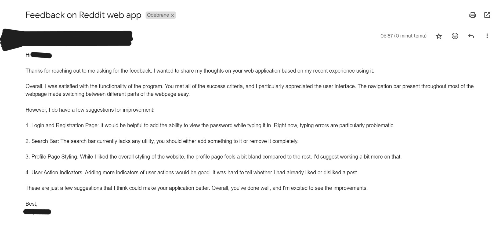

# Project Unit 4

## Criteria C: Development

### Techniques used
* Flask routes
* If statements
* For loops
* Variables
* Functions
* OOP
* Methods
* Hashing
* SQL queries
* Input validation
* Session management
* Database management
* HTML templates
* CSS styling
* GET and POST requests
* Version control

### Existing tools/libraries used
* Flask
* SQLite
* Jinja2
* Bootstrap
* Git
* Werkzeug
* os
* Passlib
* ChatGPT to generate css and populate databases for testing

### Code snippets

#### Registration System
One of the success criteria states that there has to be a registration system. This is important as it allows the 
system to distinguish between users, allowing for functionality such as commenting and posting, user profile pages, 
and following other users or subreddits. The success criteria also state that this system needs to be hashed, so that 
the password stays secure. The following snippet shows how this was done in my program:

```python
@app.route('/register', methods=['GET', 'POST'])
def register():
    if request.method == 'POST':
        uname = request.form.get('uname')
        password = request.form.get('psw')
        email = request.form.get('email')

        hashed_password = make_hash(password)

        db = DatabaseWorker('Reddit.db')
        existing_user = db.search(query=f"SELECT * FROM users WHERE username='{uname}'", multiple=False)

        if existing_user:
            db.close()
            flash('Username already exists. Please choose a different one.')
            return redirect(url_for('register'))

        db.run_query(query=f"INSERT INTO users (username, password, email) VALUES ('{uname}', '{hashed_password}', '{email}')")
        db.close()

        flash('Registration successful! You can now log in.')
        return redirect(url_for('login'))

    return render_template('register.html')
```

Now, a detailed explanation of the code above:
```python
@app.route('/register', methods=['GET', 'POST'])
```
This line defines the '/register' route that will be used for the registration. The methods allowed are GET and POST. GET will be used when the user accesses the route, and POST will be used when the user submits the registration form.

```python
if request.method == 'POST':
```
This line checks if there is a POST request, which, as I explained before, means that the user has submitted the registration form. If that is the case, the code block below will be executed.

```python
uname = request.form.get('uname')
password = request.form.get('psw')
email = request.form.get('email')
```
These lines get the values of the username, password, and email from the form that the user submitted. The 'uname', 'psw', and 'email' are the names of the input fields in the HTML form.

```python
hashed_password = make_hash(password)
```
This line hashes the password using the make_hash function. This function is a custom function that I created to hash the password using the sha256_crypt method from the passlib library.

```python
db = DatabaseWorker('Reddit.db')
existing_user = db.search(query=f"SELECT * FROM users WHERE username='{uname}'", multiple=False)
```
These lines create a DatabaseWorker object and search for a user with the same username as the one submitted by the user. If the user already exists, the existing_user variable will be set to the user's data. If the user does not exist, the existing_user variable will be set to None.

```python
if existing_user:
    db.close()
    flash('Username already exists. Please choose a different one.')
    return redirect(url_for('register'))
```
This block checks if the user already exists. If it does, the user will be redirected back to the registration page with a message saying that the username already exists.

```python
db.run_query(query=f"INSERT INTO users (username, password, email) VALUES ('{uname}', '{hashed_password}', '{email}')")
db.close()
```
These lines insert the new user into the database. The username, hashed password, and email are inserted into the 'users' table. After that, the database connection is closed.

```python
return redirect(url_for('login'))
```
This line redirects the user to the login page after the registration is successful.

```python
return render_template('register.html')
```
If the request method is not POST, the user will be shown the registration form.

#### Viewing and commenting on posts
Of course, in a website like Reddit, the most important feature is the ability to view posts. This is done by querying 
the database for the posts and comments and displaying them on the page. The following snippet shows how this was done 
in my program:

```python
@app.route('/post/<int:post_id>', methods=['GET', 'POST'])
def view_post(post_id):
    current_user_id = request.cookies.get('user_id')
    db = DatabaseWorker('Reddit.db')
    post = db.search(query=f'SELECT posts.id, posts.title, posts.content, users.id AS user_id, posts.image_url, users.username, posts.post_time FROM posts JOIN users ON posts.user_id = users.id WHERE posts.id={post_id}', multiple=False)
    comments = db.search(query=f'SELECT comments.id, comments.content, users.id AS user_id, users.username, comments.created_at FROM comments JOIN users ON comments.user_id = users.id WHERE comments.post_id={post_id}', multiple=True)

    if request.method == 'POST':
        content = request.form.get('comment')
        user_id = request.cookies.get('user_id')
        db.run_query(query=f"INSERT INTO comments (post_id, user_id, content) VALUES ({post_id}, {user_id}, '{content}')")
        db.close()
        return redirect(url_for('view_post', post_id=post_id))

    db.close()
    return render_template('view_post.html', post=post, comments=comments, current_user_id=int(current_user_id))
```

Now, a detailed explanation of the code above:
```python
@app.route('/post/<int:post_id>', methods=['GET', 'POST'])
```
This line defines the '/post/<int:post_id>' route that will be used for viewing a post. The methods allowed are GET and 
POST. GET will be used when the user accesses the route, and POST will be used when the user submits a comment.

```python
current_user_id = request.cookies.get('user_id')
```
This line gets the user's ID from the cookies. This ID is used to check if the user is logged in and to display the 
correct information on the page.

```python
db = DatabaseWorker('Reddit.db')
post = db.search(query=f'SELECT posts.id, posts.title, posts.content, users.id AS user_id, posts.image_url, users.username, posts.post_time FROM posts JOIN users ON posts.user_id = users.id WHERE posts.id={post_id}', multiple=False)
comments = db.search(query=f'SELECT comments.id, comments.content, users.id AS user_id, users.username, comments.created_at FROM comments JOIN users ON comments.user_id = users.id WHERE comments.post_id={post_id}', multiple=True)
```
These lines create a DatabaseWorker object and query the database for the post and comments with the given post_id. 
The post data includes the post's title, content, image URL, user ID, username, and post time. The comments data 
includes the comments' content, user ID, username, and creation time.

```python
if request.method == 'POST':
    content = request.form.get('comment')
    user_id = request.cookies.get('user_id')
    db.run_query(query=f"INSERT INTO comments (post_id, user_id, content) VALUES ({post_id}, {user_id}, '{content}')")
    db.close()
    return redirect(url_for('view_post', post_id=post_id))
```
This block checks if there is a POST request, which means that the user has submitted a comment. If that is the case, 
the comment content and user ID are extracted from the form, and the comment is inserted into the database. After that, 
the user is redirected back to the post page.

```python
db.close()
```
This line closes the database connection.

```python
return render_template('view_post.html', post=post, comments=comments, current_user_id=int(current_user_id))
```
If the request method is not POST, the user will be shown the post page. The post data and comments data are passed to 
the template, along with the current user's ID.

#### Creating a post
Another important feature of Reddit is the ability to create posts. This is done by allowing the user to submit a form, 
in which they can enter the post's title, content, and image, as well as include the subreddit they want to post on. 
This also completes one of the success criteria, which states that the program has to allow uploading images. The 
following snippet shows how this was done in my program:

```python
@app.route('/create_post', methods=['GET', 'POST'])
def create_post():
    if request.method == 'POST':
        title = request.form.get('title')
        content = request.form.get('content')
        subreddit = request.form.get('subreddit')
        user_id = request.cookies.get('user_id')
        file = request.files['image']

        if file and allowed_file(file.filename):
            filename = secure_filename(file.filename)
            file_path = os.path.join(app.config['UPLOAD_FOLDER'], filename)
            file.save(file_path)
            image_url = url_for('static', filename='uploads/' + filename)
        else:
            image_url = None

        db = DatabaseWorker('Reddit.db')
        db.run_query(
            query=f"INSERT INTO posts (title, content, user_id, upvotes, downvotes, subreddit, image_url) VALUES ('{title}', '{content}', {user_id}, 0, 0, '{subreddit}', '{image_url}')")
        db.close()
        return redirect(url_for('home'))

    db = DatabaseWorker('Reddit.db')
    subreddits = db.search(query='SELECT name FROM subreddits', multiple=True)
    db.close()
    return render_template('create_post.html', subreddits=subreddits)
```

Now, a detailed explanation of the code above:
```python
@app.route('/create_post', methods=['GET', 'POST'])
```
This line defines the '/create_post' route that will be used for creating a post. The methods allowed are GET and POST. 
GET will be used when the user accesses the route, and POST will be used when the user submits the post form.

```python
if request.method == 'POST':
```
This line checks if there is a POST request, which means that the user has submitted the post form. If that is the 
case, the code block below will be executed.

```python
title = request.form.get('title')
content = request.form.get('content')
subreddit = request.form.get('subreddit')
user_id = request.cookies.get('user_id')
file = request.files['image']
```
These lines get the values of the title, content, subreddit, and image from the form that the user submitted. They also 
get the user's ID from the cookies. The 'title', 'content', 'subreddit', and 'image' are the names of the input fields 
in the HTML form.

```python
if file and allowed_file(file.filename):
    filename = secure_filename(file.filename)
    file_path = os.path.join(app.config['UPLOAD_FOLDER'], filename)
    file.save(file_path)
    image_url = url_for('static', filename='uploads/' + filename)
else:
    image_url = None
```
This block checks if the file exists and if it is an allowed file type. If both conditions are met, the file is saved.
The filename is secured using the secure_filename function from the Werkzeug library. The image URL is generated using 
the url_for function, which creates a URL for the static file.

```python
db = DatabaseWorker('Reddit.db')
db.run_query(
    query=f"INSERT INTO posts (title, content, user_id, upvotes, downvotes, subreddit, image_url) VALUES ('{title}', '{content}', {user_id}, 0, 0, '{subreddit}', '{image_url}')")
db.close()
return redirect(url_for('home'))
```
These lines create a DatabaseWorker object and insert the new post into the database. The post's title, content, and 
user_id are inserted into the 'posts' table. The upvotes and downvotes are set to 0, and the subreddit and image URL 
are also inserted. After that, the user is redirected to the home page.

```python
db = DatabaseWorker('Reddit.db')
subreddits = db.search(query='SELECT name FROM subreddits', multiple=True)
db.close()
```
These lines create a DatabaseWorker object and query the database for the list of subreddits. The subreddits' names are 
stored in the 'subreddits' variable, which is passed to the template so that the user can pick which subreddit to post 
to.

```python
return render_template('create_post.html', subreddits=subreddits)
```
If the request method is not POST, the user will be shown the post form. The list of subreddits is passed to the template

### Computational Thinking

#### Abstraction
In my program, I used abstraction to hide the complexity of the database operations from the main code. I created a 
DatabaseWorker class that handles all the database operations, such as connecting to the database, running queries, 
and closing the connection. This class abstracts the database operations into simple methods that can be called from 
the main code. This makes the main code cleaner and easier to read, as it does not have to deal with the details of the 
database operations.

#### Decomposition
In my program, I used decomposition to break down the main functionality into smaller, more manageable parts. For 
example, the registration system is broken down into several parts: checking if the user already exists, hashing the 
password, inserting the new user into the database, and redirecting the user to the login page. Each part of the 
registration system is implemented as a separate block of code, which makes the code easier to understand and maintain. 
Decomposition is also used in a broader scope throughout the program, with each route handling a specific 
functionality, such as viewing posts, creating posts, and commenting on posts.

#### Pattern Recognition
In my program, I used pattern recognition to identify common patterns in the code and reuse them in different parts of 
the program. For example, the code for querying the database and rendering the template is repeated in multiple routes. 
To avoid code duplication, I created a DatabaseWorker class that handles all the database operations, and I used the 
render_template function to render the HTML templates. By recognizing and reusing patterns in the code, I was able to 
make the program more efficient and maintainable.

#### Algorithms
In my program, I used algorithms to implement various features, such as the registration system, posting system, and 
commenting system. For example, the registration system uses an algorithm to hash the password using the sha256_crypt 
method from the passlib library. The posting system uses algorithms to insert posts and comments into the database and 
retrieve them for display. The commenting system uses algorithms to add, edit, and delete comments under posts. By 
using algorithms to implement these features, I was able to create a functional and efficient program.


## Criteria D: Functionality

[20240602-0625-50.3556384.mp4](..%2F..%2FAppData%2FLocal%2FPackages%2FMicrosoft.ScreenSketch_8wekyb3d8bbwe%2FTempState%2FRecordings%2F20240602-0625-50.3556384.mp4)

## Criteria E: Evaluation

### Meeting the Success Criteria

| Criteria                                                            | Met | Description                                                                                                                                                                                                                 |
|---------------------------------------------------------------------|-----|-----------------------------------------------------------------------------------------------------------------------------------------------------------------------------------------------------------------------------|
| A hashed login/registration system                                  | Yes | Register and login routes in app.py allow the user to register and log in. Passwords are hashed using sha256_crypt.                                                                                                         |
| A posting system to EDIT/CREATE/DELETE comments                     | Yes | Users can add, edit, and delete comments under posts. All comments are tied to users, ensuring that only the original commenter can edit and delete their comments.                                                         |
| A system to add/remove likes                                        | Yes | Users can add and remove likes or dislikes. Their difference will be shown next to each post in the home page. Each user can only add one like or dislike under one post.                                                   |
| A system to follow/unfollow users, follow/unfollow topics or groups | Yes | Users can follow and unfollow users and subreddits. The button to do so is located on the individual profile pages and subreddit pages, which can be accessed through a link embedded into each username or subreddit name. |
| A profile page with relevant information                            | Yes | Users have a profile page that displays their username, a profile description that can be edited by the user, a list of followed subreddits, followed users, followers, and posts.                                          |
| upload images                                                       | Yes | Users can include images when creating a post, which will later be displayed when viewing a post. The system makes sure that only png, jpg, jpeg, and gif files can be uploaded.                                            |

### Client Feedback (peer review in this case)


**Fig 1.** Feedback from peers in an email

My peers were generally satisfied with the functionality of the program and praised the user interface. They found that
all the success criteria were met, and they commented on the ease of use, particularly on the navigation bar present 
throughout most of the routes on the webpage, which allowed for easy switching between routes. However, they also said 
that the login and registration page could be improved by adding the ability to view the password when typing it in. 
They also suggested adding a use for the search bar, which is currently does not have any functionality. They also 
thought that the styling of the profile page was a bit bland in comparison to the rest of the website. Finally, they 
suggested adding more indicators of the user's actions, such as making it clear whether the user liked or disliked a post.

### Improvements

#### Ideas that emerged from customer feedback

* Add the ability to view the password when typing it in on the login and registration pages.
* Add functionality to the search bar.
* Improve the styling of the profile page.
* Add more indicators of the user's actions, such as making it clear whether the user liked or disliked a post.

#### Ideas that emerged from personal reflection that I think should be implemented

* Make users confirm their password when registering, as there is no functionality to reset a forgotten password.
* Add a password strength validator to make the passwords more secure.
* Make it easier to navigate to other users' profiles, as the only way to do so is by clicking on the username of a post's or comment's author. This could possibly be done through the search bar, which would also address the issue raised by my peers.
* Add a feature that allows users to delete their accounts and their posts.
* Allow for the creation of subreddits by users.

#### Ideas for further development

* Add a 'for you page' that shows posts from only from subreddits that the user follows.
* Add options to sort posts by the number of upvotes and to set a limit on how long ago the post was made.
* Add comment threads, were users can reply to comments, and those replies can be replied to as well.
* Add a moderator role, where certain users can delete posts and comments, and ban users on the subreddit where they have the role.


## Sources

* [Flask Documentation](https://flask.palletsprojects.com/en/2.0.x/)
* [SQLite Documentation](https://www.sqlite.org/docs.html)
* [Jinja2 Documentation](https://jinja.palletsprojects.com/en/3.0.x/)
* [Bootstrap Documentation](https://getbootstrap.com/docs/5.1/getting-started/introduction/)
* [Werkzeug Documentation](https://werkzeug.palletsprojects.com/en/2.0.x/)
* [Passlib Documentation](https://passlib.readthedocs.io/en/stable/)
* [os Documentation](https://docs.python.org/3/library/os.html)
* [html tags on w3schools](https://www.w3schools.com/tags/)
* [css properties on w3schools](https://www.w3schools.com/cssref/)
* [stackoverflow](https://stackoverflow.com/)
* [uploading images in Flask](https://www.geeksforgeeks.org/how-to-upload-file-in-python-flask/)
* [ChatGPT](https://chat.openai.com/)